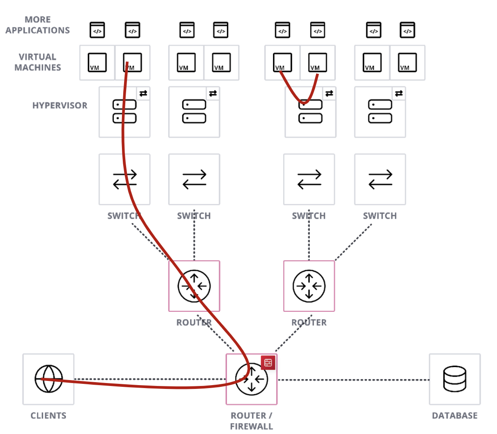

name: Chapter-1
class: center,middle
.section[
Chapter 1  
HashiCorp Consul Overview
]

---
name: HashiCorp-Consul-Overview
Consul Overview
-------------------------
.center[

]

HashiCorp Consul is an API-driven, service networking solution to connect and secure services across any runtime platform and public or private cloud.

For additional descriptions or instructions that expand on this workshop, please see the docs, API guide, and learning site:
* https://www.consul.io/docs/
* https://www.consul.io/api/
* https://learn.hashicorp.com/consul/

---
name: The-Shift
The shift from static to dynamic
-------------------------
.center[]
.center[Physical servers, to VMs, to containers...]

As our applications have shifted from monoliths to microservices, the networking landscape has changed drastically. Let's briefly explore the history  of this shift, and how Consul can help us with its  challenges.

---
name: Client-Server
Introduction of Client & Server
-------------------------
.center[]

.center[Monolithic request, response]

* Single application per Server
* No app mobility
* Security mapped to IP
* Seldom horizontal scale of an app
* High trust zones and perimeter

---
name: Introduction-of-VMs
Introduction of the VM
-------------------------
.center[]
.center[Improvements from Virtualization]

* Better HW utilization
* Basic networking in Hypervisor
* VM mobility
* Some Horizontal scaling
* Load balancers
* Spanning trees

---
name: Introduction-of-the-Fabric
Introduction of the Fabric
-------------------------
.center[]
.center[Enter the fabric]

* L2 Fabrics
* Mostly proprietary L2 routing
* More single service instances
* More Load Balancers
* Spine & Leaf

---
name: Introduction-of-the-Microservice
Introduction of the Microservice
-------------------------
.center[]
.center[Where is my stuff?]

* Highly maintainable and testable
* Loosely coupled
* Independently deployable
* Organized around business capabilities
* Owned by a small team

---
name: Introduction-of-the-SDN
Introduction of the SDN
-------------------------
.center[]
.center[My network needs an API!]

* Network automation
* Self-Service
* Separation of duties - Who operates SDN?
* Lower visibility for network admin

---
name: Introduction-of-the-Multi-Cloud-Hybrid
Introduction of Mutli-Cloud - Hybird
-------------------------
.center[]
.center[Ephemeral IP address in Public Cloud]
* Where is my app instance?

---
name: Introduction-of-the-Multi-Cloud-K8s
Introduction of Mutli-Cloud - K8s
-------------------------
.center[]
* K8s src IP
* K8s networking - NAT / Calico / Flannel
* Access to K8S service - K8S Ingress et al

---
name: Introduction-Summary
Summary
-------------------------
.center[]
As you can see our networking model have drastically changed.
Let's learn a little more about how Consul works, and then we can revisit these challenges with Consul.

---
name: Interacting-Hands-On-Lab
Hands-On Lab - Interacting with Consul
-------------------------
You will accomplish the following in this lab:

* Set Up a 3 Node Consul Cluster
* Use the Consul UI
* Use the Consul CLI
* Use the Consul API
* Add an App Node to Your Cluster
* Test Consul's High Availability
* Add Basic Security with Consul's ACLs

<a href="https://instruqt.com/hashicorp/tracks/consul-basics" target="_blank">Go to the lab</a>