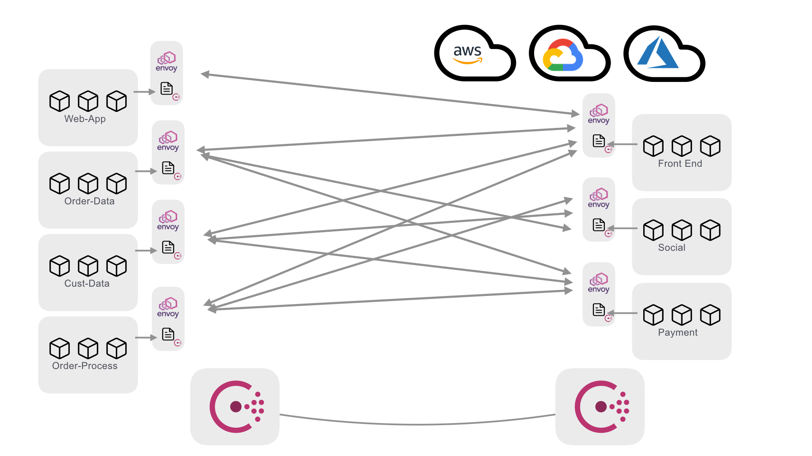
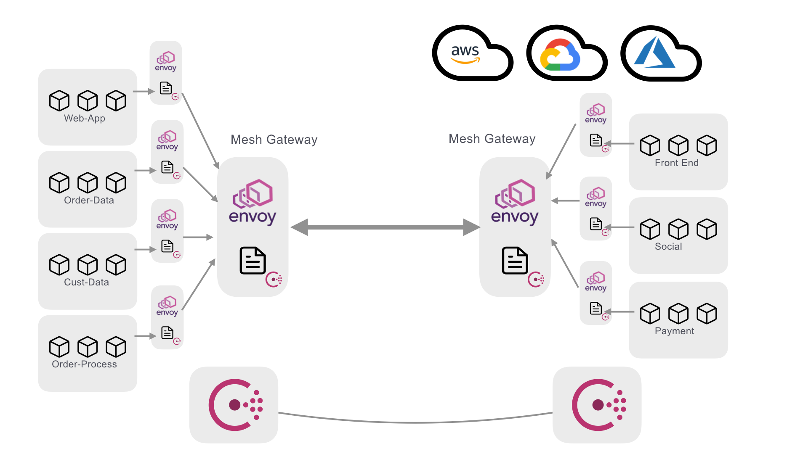

name: Chapter-4
class: center,middle
.section[
Chapter 4  
Consul Use Cases
]

---
name: Consul-Use-Cases
Consul Adoption Journey
-------------------------
.center[]

???
As we start to dive into how to use consul it is important to think about how you would go about adopting this in your environments.  First and foremost adopting a standard way of service discovery across a single application of federation of applications is a critical first step.  Because of this we will begin with looking at consul's robust feature set around service discovery.

---
name: Load-Balancers-Service-Discovery
Service Discovery and Load Balancers
-------------------------

.center[]
* Services location is paramount
* Traditionally done with load balancers
   * Expensive
   * Hard to maintain
   * Load grows as you scale
   * Requires health probes for every backend system
???
The current mode of operation for handling service discovery is usually done with load balancers as seen her in the diagram.  When I want to provision a new service it gets deployed and then the network team is notified that they need to configure the virtual IPs on the load balancer to pick up the service and start routing traffic to it.  This is time consuming, error prone, and can typically have long lead times.  Consul can solve this problem.

---
name: Service-Discovery-with-Consul
Service Discovery with Consul
-------------------------
.center[]
* Services self-register
* Service health is defined by the service and maintained by the consul agent
* Services are able to query each other via DNS or HTTP
   
???
In a consul environment services are able to self register along with their unique health check requirements.  This makes it easy to define and healthy service.  This coupled with consul using gossip service routing and availibility is near real time.  This allows for service discovery to be offloaded from the network and load balancer teams to the application deployment pipeline.  This is a crucial first step esp if an organization wants to take advantage of the benifits of a service mesh.


---
name: Data-Center-Failover
Basic Data Center Failover
-------------------------
Consul prepared queries allow you to build logic into your DNS based service catalog. This enables transparent failover when the primary datacenter becomes unavailable.

```json
{
  "Name": "banking-app",
  "Service": {
    "Service": "banking-app",
    "Tags": ["v1.2.3"],
    "Failover": {
      "Datacenters": ["dc2", "dc3"]
    }
  }
}
```
???
Because consul is now at the heart of service routing based on service name then failover becomes defined at the service level.  Simply by setting the failover path in your registration you have defined what happens in a failure situation at the service level.  Having this granular path allows for built in resilencey for downstream dependencies.  
---
name: Consul-Service-Mesh
Consul - A Modern Service Mesh
-------------------------
.center[]

* Once applications can find each other security becomes the next concern
* This is usually done with a heavy dose of firewalls
* This adds signifigant burden to the network organization 
* Huge lists of firewall rules
???
Take your applications into the future while remaining compatible with legacy systems. Consul Connect is a multi-cloud friendly service mesh that can safely and automatically connect services and applications from anywhere on your network. 

This greatly reduces the amount of complexity needed to route traffic securely between endpoints.

---
name: Consul-Service-Mesh
Consul - Firewall Segmentation
-------------------------
.center[]
* Heavy interdependancies
* Hard to automate
* Hard to optimize

???
If you take this mindset to its logical conclustion you will end up with something like this.  Firewalls at every service trying to maintain all the up and downstream communications channels.  At scale this is completely unmanagable.  
---
name: Consul-Service-Mesh
Consul - A Modern Service Mesh
-------------------------
.center[]

???
Using consul in conjuction with a proxy (in this case Envoy) will allow for several things.  
First using consul ACL tokens you give a service an identity that is not IP based.  With this token the service is able to present an identity that is tied to the service no matter where it is running.
Second you have defined intentions.  This construct is how you define what service is allowed to talk to what service.  And thirdly it provides all the near real time configurations to support a mTLS connection between services.  Things like Certficates and proxy configs are all automatically handled by consul.
The power of this is that all of this can be defined in a simple service definition.  
---
name: Consul-Service-Mesh
Consul - Service Definition
-------------------------

```hcl
services {
  name = “web-app"
  port = 9090

  connect {
    sidecar_service {
      port = 20000

      proxy {
        local_service_address = "127.0.0.1"
        local_service_port = 9090

        upstreams {
          destination_name = “order-processing”
          local_bind_port = 8003
        }
      }
    }
  }
}
```
???
As you can see in this example all the connection definition is simply defined as a part of the service definition.  
---
name: Consul-Service-Mesh
Consul - A Modern Service Mesh
-------------------------
.center[]
???
Now at scale inside a service mesh there might start to be some issue with all these connection zipping around between datacenters and clouds.  It becomes a lot more difficult to maintain good network edge security when you have a wide berth of communication happening even if the port range is well defined.  
---
name: Consul-Service-Mesh
Consul - A Modern Service Mesh
-------------------------
.center[]
???
This problem is addressed with the abiltiy have mesh gateways.  This allows a single point at the edge that all mesh traffic flows over.  This allows the network teams to control the ingress/egress points at the edge of the network while still allowing the app teams the flexability to run application componets on the platform of their choosing.  In the next lab we are going to explore the concepts of a service mesh in instruqt.
