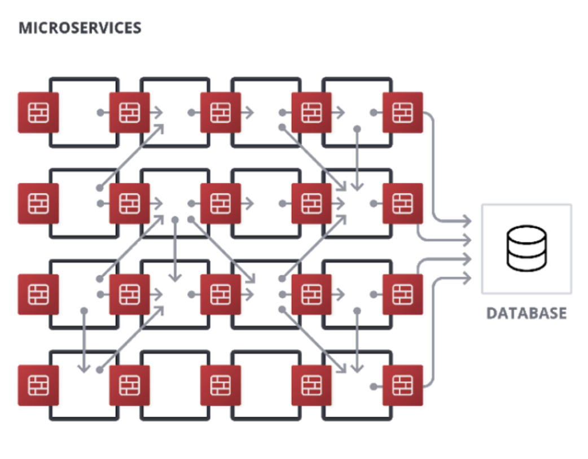
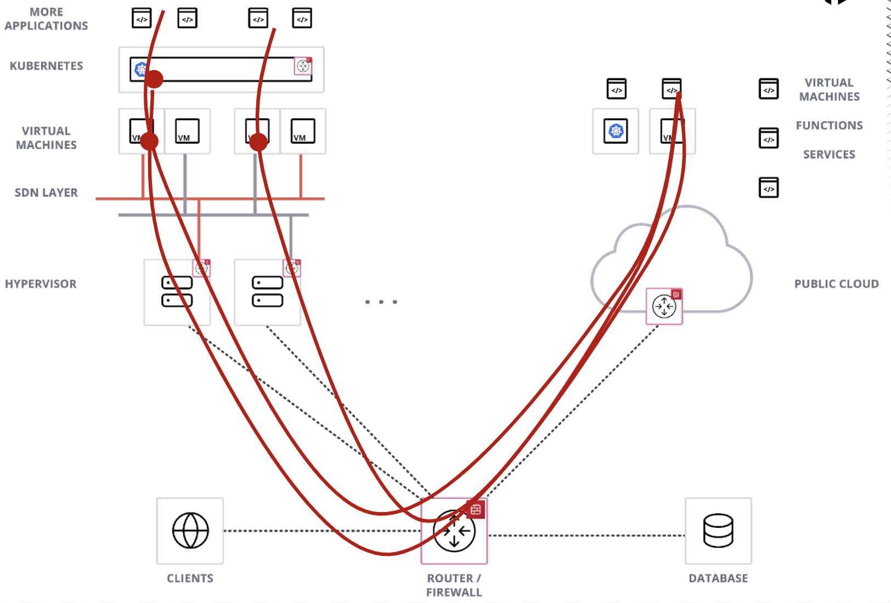
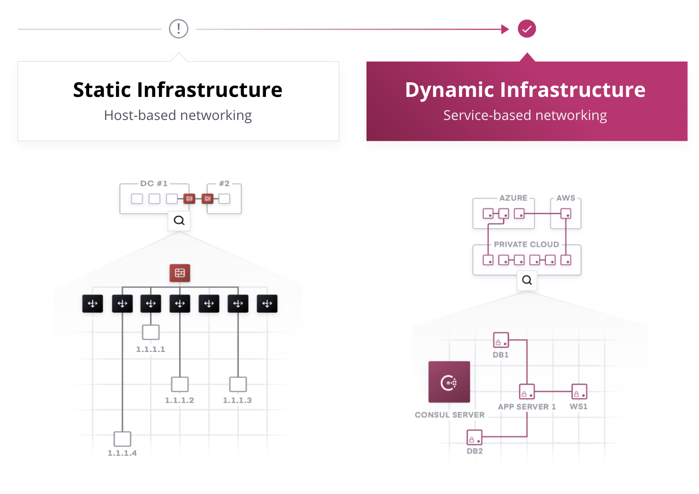
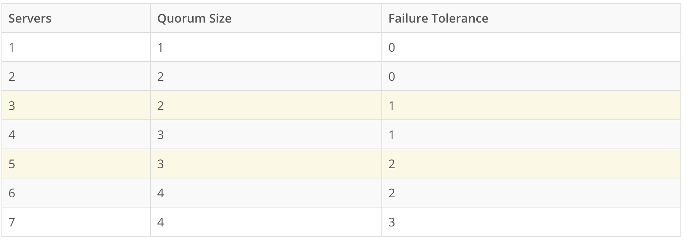

name: Consul-OSS-Workshop
class: center,middle,title-slide
count: false

.titletext[
Consul OSS Workshop]
Connect and Secure Services across any platform.

???
Welcome to the beginner's guide to Consul OSS.

---
name: Link-to-Slide-Deck
The Slide Deck
-------------------------
   
.center[
Follow along on your own computer at this link:

### [hashicorp.github.io/field-workshops-consul/oss](https://hashicorp.github.io/field-workshops-consul/oss)
]

---
name: Introductions
Introductions
-------------------------

.contents[
* Your Name
* Job Title
* Automation Experience
* Favorite Text Editor
]

???
Use this slide to introduce yourself, give a little bit of your background story, then go around the room and have all your participants introduce themselves.

The favorite text editor question is a good ice breaker, but perhaps more importantly it gives you an immediate gauge of how technical your users are.  

**There are no wrong answers to this question. Unless you say Notepad. Friends don't let friends write code in Notepad.**

**If you don't have a favorite text editor, that's okay! We've brought prebuilt cloud workstations that have Visual Studio Code already preinstalled. VSC is a free programmer's text editor for Microsoft, and it has great Terraform support. Most of this workshop will be simply copying and pasting code, so if you're not a developer don't fret. Terraform is easy to learn and fun to work with.**

---
name: Table-of-Contents
class: center,middle
Table of Contents
=========================

.contents[

0. Consul Overview
1. Consul Architecture
1. Consul Use Cases
1. Lab Environment
1. Interacting with Consul (CLI, GUI, API)
1. Service Discovery
1. Service Segmentation
]

???
TODO: Speaker talk track for the table of contents.

---
name: Chapter-1
class: center,middle
.section[
Chapter 1  
HashiCorp Consul Overview
]

---
name: HashiCorp-Consul-Overview
Consul Overview
-------------------------
.center[

]

HashiCorp Consul is an API-driven, service networking solution to connect and secure services across any runtime platform and public or private cloud.

For additional descriptions or instructions that expand on this workshop, please see the docs, API guide, and learning site:
* https://www.consulproject.io/docs/
* https://www.consulproject.io/api/
* https://learn.hashicorp.com/consul/

---
name: The-Shift
The shift from static to dynamic
-------------------------
.center[]
.center[Physical servers, to VMs, to containers...]

As our applications have shifted from monoliths to microservices, the networking landscape has changed drastically. Let's briefly explore the history  of this shift, and how Consul can help us with its  challenges.

---
name: Client-Server
Introduction of Client & Server
-------------------------
.center[]

.center[Monolithic request, response]

* Single application per Server
* No app mobility
* Security mapped to IP
* Seldom horizontal scale of an app
* High trust zones and perimeter

---
name: Introduction-of-VMs
Introduction of the VM
-------------------------
.center[]
.center[Improvements from Virtualization]

* Better HW utilization
* Basic networking in Hypervisor
* VM mobility
* Some Horizontal scaling
* Load balancers
* Spanning trees

---
name: Introduction-of-the-Fabric
Introduction of the Fabric
-------------------------
.center[]
.center[Enter the fabric]

* L2 Fabrics
* Mostly proprietary L2 routing
* More single service instances
* More Load Balancers
* Spine & Leaf

---
name: Introduction-of-the-Microservice
Introduction of the Microservice
-------------------------
.center[]
.center[Where is my stuff?]

* Highly maintainable and testable
* Loosely coupled
* Independently deployable
* Organized around business capabilities
* Owned by a small team

---
name: Introduction-of-the-SDN
Introduction of the SDN
-------------------------
.center[]
.center[My network needs an API!]

* Network automation
* Self-Service
* Separation of duties - Who operates SDN?
* Lower visibility for network admin

---
name: Introduction-of-the-Multi-Cloud-Hybrid
Introduction of Mutli-Cloud - Hybird
-------------------------
.center[]
.center[Ephemeral IP address in Public Cloud]
* Where is my app instance?

---
name: Introduction-of-the-Multi-Cloud-K8s
Introduction of Mutli-Cloud - K8s
-------------------------
.center[]
* K8s src IP
* K8s networking - NAT / Calico / Flannel
* Access to K8S service - K8S Ingress et al

---
name: Introduction-Summary
Summary
-------------------------
.center[]
As you can see our networking model have drastically changed.
Let's learn a little more about how Consul works, and then we can revisit these challenges with Consul.

---
name: Chapter-2
class: center,middle
.section[
Chapter 2
HashiCorp Consul Architecture
]

---
name: Introduction-to-Consul
Introduction to Consul - 10,000 foot view
-------------------------
.center[]

Consul is a complex system that has many different moving parts. To help users and developers of Consul form a mental model of how it works, this page documents the system architecture.

In the next sections, we will dive deeper into how  Consul works.

---
name: Introduction-to-Consul-Overview
Introduction to Consul - Overview
-------------------------
.center[]

Within each datacenter, we have a mixture of clients and servers. It is expected that there be between three to five servers. This strikes a balance between availability in the case of failure and performance, as consensus gets progressively slower as more machines are added. However, there is no limit to the number of clients, and they can easily scale into the thousands or tens of thousands.

---
name: Introduction-to-Consul-Gossip
Introduction to Consul - Gossip
-------------------------

All the agents that are in a datacenter participate in a gossip protocol. This means there is a gossip pool that contains all the agents for a given datacenter. This serves a few purposes: first, there is no need to configure clients with the addresses of servers; discovery is done automatically. Second, the work of detecting agent failures is not placed on the servers but is distributed. This makes failure detection much more scalable than naive heartbeating schemes. It also provides failure detection for the nodes; if the agent is not reachable, then the node may have experienced a failure.

---
name: Introduction-to-Consul-Consensus
Introduction to Consul - Consensus
-------------------------
.center[]

The servers in each datacenter are all part of a single Raft peer set. This means that they work together to elect a single leader, a selected server which has extra duties. The leader is responsible for processing all queries and transactions. Transactions must also be replicated to all peers as part of the consensus protocol. Because of this requirement, when a non-leader server receives an RPC request, it forwards it to the cluster leader.

---
name: Introduction-to-Consul-Multi-DC
Introduction to Consul - Multi-DC
-------------------------
.center[]

The server agents also operate as part of a WAN gossip pool. This pool is different from the LAN pool as it is optimized for the higher latency of the internet and is expected to contain only other Consul server agents. The purpose of this pool is to allow datacenters to discover each other in a low-touch manner. When a server receives a request for a different datacenter, it forwards it to a random server in the correct datacenter. That server may then forward to the local leader, so cross-datacenter requests are relatively fast and reliable.

---
name: Introduction-to-Consul-Protocols
Introduction to Consul - Protocols
-------------------------
We will dive deeper into Consul's two primary protocols in the next sections:
* Consensus
* Gossip

---
name: Introduction-to-Consensus
Introduction to Consensus
-------------------------

Consul uses a consensus protocol to provide consistency.
It is not necessary to understand consensus in detail, but you below are a few terms you will find useful when learning about Consul.

* Log - The primary unit of work in a Raft system is a log entry.
* FSM (Finite State Machine) - An FSM is a collection of finite states with transitions between them.
* Peer set - The peer set is the set of all members participating in log replication.
* Quorum - A quorum is a majority of members from a peer set.
* Committed Entry - An entry is considered committed when it is durably stored on a quorum of nodes.
* Leader - At any given time, the peer set elects a single node to be the leader.

There is a helpful visualization on the next slide.

---
name: Consensus-Visualization
Consensus - A Visualization
-------------------------

<iframe  width="100%" height="85%"
  src="https//thesecretlivesofdata.com/raft/">
</iframe>

---
name: Consensus-Modes
Consensus - Consistency Modes
-------------------------

While it's not required you understand Consensus under the hood, you should understand the various  consistency  modes so you can optimize for your workload.

* Default - Raft makes use of leader leasing, providing a time window in which the leader assumes its role is stable. However, if the old leader services any reads, the values are potentially stale. We make this trade-off because reads are fast, usually strongly consistent, and only stale in a hard-to-trigger situation.

* Consistent - This mode is strongly consistent without caveats. It requires that a leader verify with a quorum of peers that it is still leader. This introduces an additional round-trip to all server nodes. The trade-off is always consistent reads but increased latency due to the extra round trip.

* Stale - This mode allows any server to service the read regardless of whether it is the leader. This means reads can be arbitrarily stale but are generally within 50 milliseconds of the leader. The trade-off is very fast and scalable reads but with stale values. This mode allows reads without a leader meaning a cluster that is unavailable will still be able to respond.

---
name: Consensus-Deployment-Table
Consensus - Deployment Table
-------------------------
.center[]

The table that shows quorum size and failure tolerance for various cluster sizes. The recommended deployment is either 3 or 5 servers. A single server deployment is highly discouraged as data loss is inevitable in a failure scenario.  This maximizes availability without greatly sacrificing performance.

---
name: Introduction-to-Gossip
Introduction to Gossip
-------------------------
Consul uses a gossip protocol to manage membership and broadcast messages to the cluster. All of this is provided through the use of the Serf library. The gossip protocol used by Serf is based on "SWIM: Scalable Weakly-consistent Infection-style Process Group Membership Protocol", with a few minor adaptations.

You can read more about Serf [here](https://www.serf.io/docs/internals/gossip.html).

Consul gossip operates two primary pools:
* LAN
* WAN

---
name: Introduction-to-Gossip-LAN-Pool
Introduction to Gossip - LAN Pool
-------------------------
Each datacenter Consul operates in has a LAN gossip pool containing all members of the datacenter, both clients and servers. The LAN pool is used for a few purposes. Membership information allows clients to automatically discover servers, reducing the amount of configuration needed. The distributed failure detection allows the work of failure detection to be shared by the entire cluster instead of concentrated on a few servers. Lastly, the gossip pool allows for reliable and fast event broadcasts.

---
name: Introduction-to-Gossip-WAN-Pool
Introduction to Gossip - WAN Pool
-------------------------
The WAN pool is globally unique, as all servers should participate in the WAN pool regardless of datacenter. Membership information provided by the WAN pool allows servers to perform cross datacenter requests. The integrated failure detection allows Consul to gracefully handle an entire datacenter losing connectivity, or just a single server in a remote datacenter.

---
name: Introduction-to-Gossip-Visualization-50-Node
Introduction to Gossip - Visualization
-------------------------
.center[]
.center[50 nodes, ~3.56 gossip cycles]  

Gossip in Consul scales logarithmically, so it takes O(logN) rounds in order to reach all nodes.
For a 50 node cluster, we can estimate roughly 3.56 cycles to reach all the nodes.

---
name: Introduction-to-Gossip-Visualization-100-Node
Introduction to Gossip - Visualization
-------------------------
.center[]
.center[100 nodes, ~4.19 gossip cycles]  

For a 100 node clusters, this means roughly 4.19 cycles to reach all nodes. Pretty cool!
Let's look at this for  a large cluster.

---
name: Introduction-to-Gossip-Convergence
Introduction to Gossip - Convergence
-------------------------
.center[]
.center[10k nodes, ~2 second convergence]  

The graph above shows the expected time to reach various states of convergence based on a 10k node cluster. We can converge on almost 100% of the nodes in just two seconds!

---
name: Introduction-to-Gossip-Skeptical
Introduction to Gossip - Skeptical ?
-------------------------
.center[]

---
name: Chapter-3
class: center,middle
.section[
Chapter 3
Consul Use Cases
]

---
name: Consul-Use-Cases
Consul Use Cases
-------------------------
.center[]

Remember those ever complex networking scenarios? Consul can help us bridge our multi-cloud service networking platforms by connecting and securing them.

---
name: Consul-Use-Cases
Consul Use Cases
-------------------------

<iframe width="700" height="500" sandbox="allow-same-origin allow-scripts allow-popups allow-forms" src="https://instruqt.com/embed/hashicorp/tf-aws-demo" style="border: 0;"></iframe>
