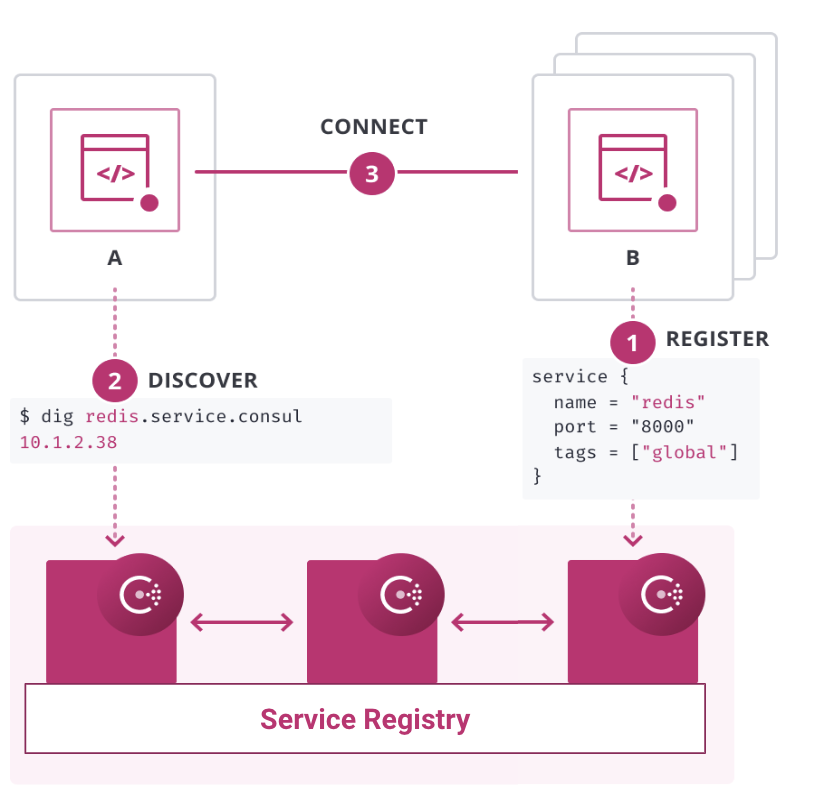
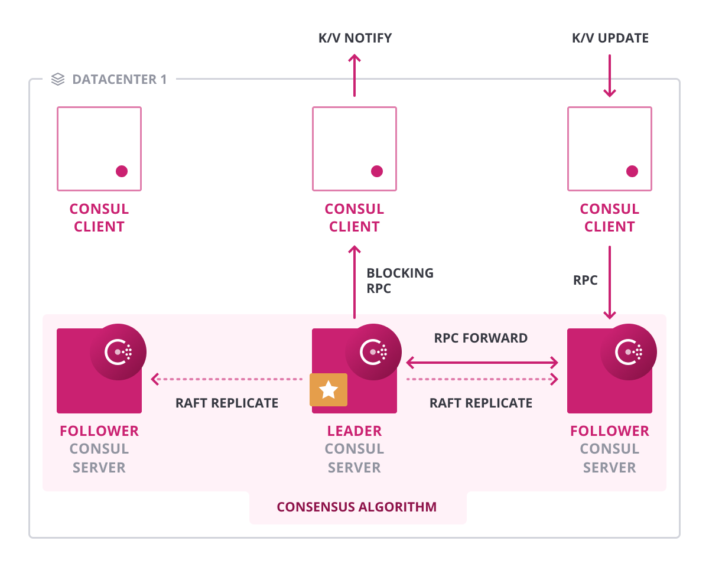
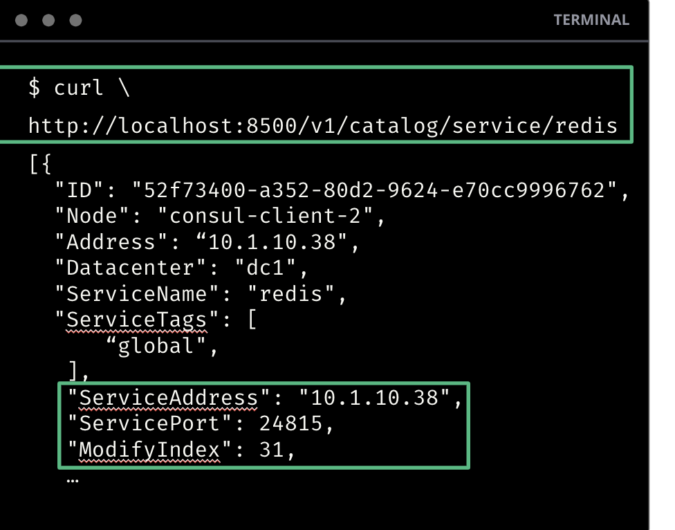
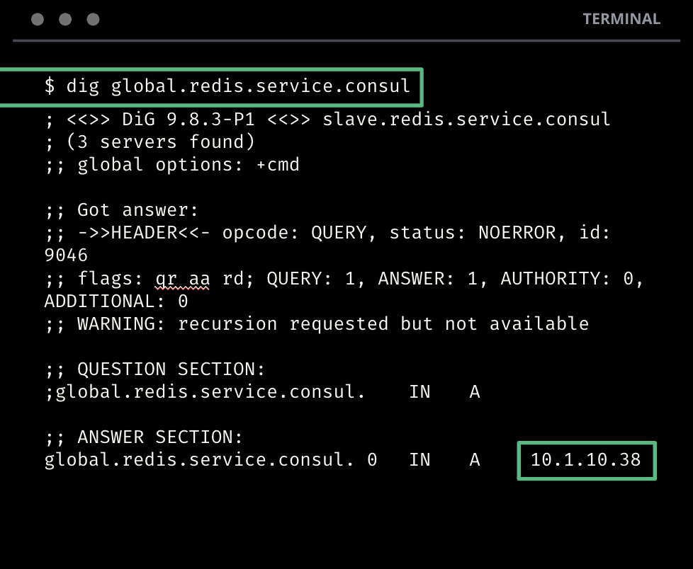
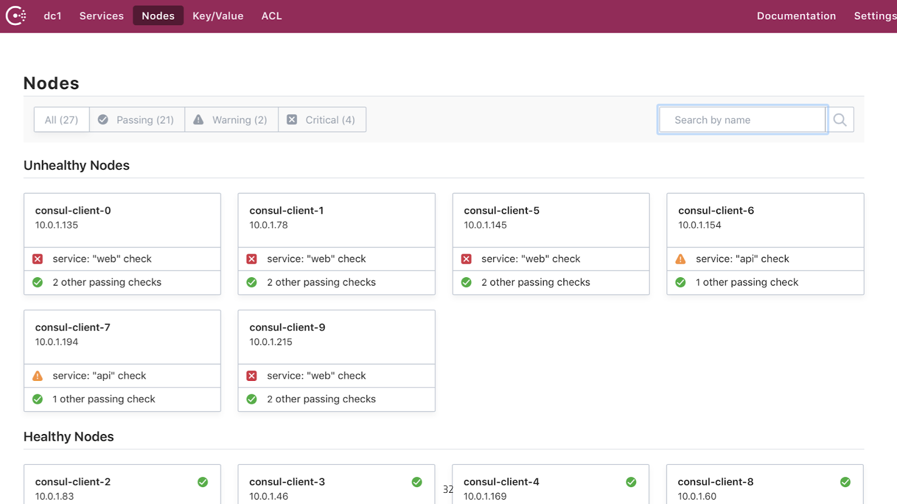
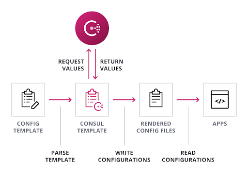
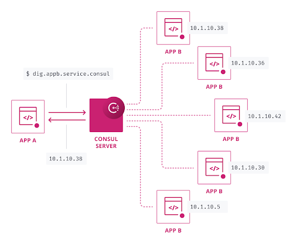
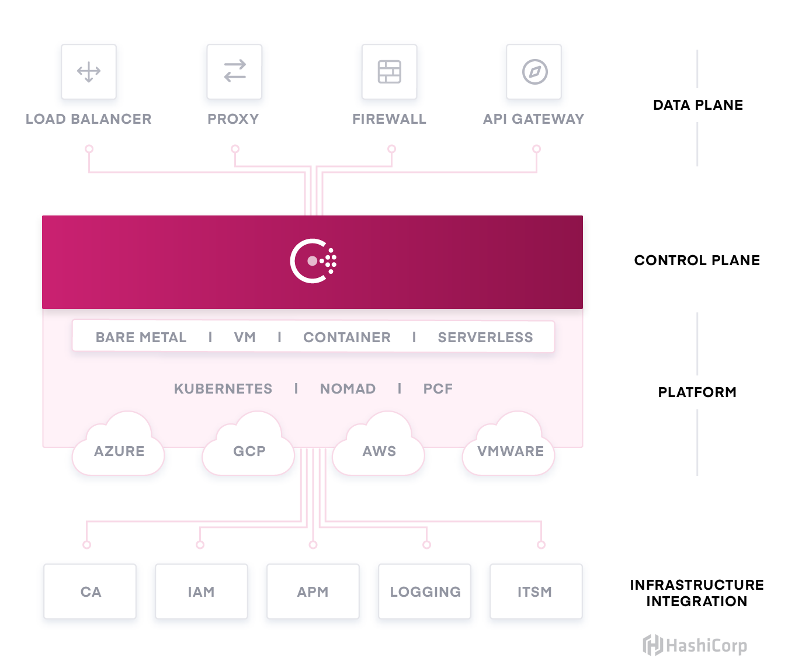
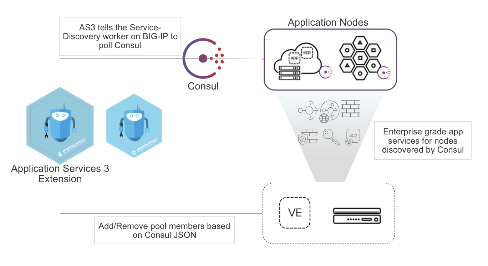

name: Chapter-5
class: title
# Chapter 5
## Service Discovery

---
name: Service-Discovery-Intro
class: img-right compact
Service Discovery - Intro
-------------------------
.center[]

The starting point for networking with Consul is typically a common service registry. This would integrate health checks and provide DNS and API interfaces to enable any service to discover and be discovered by other services.

Consul can be integrated with other services that manage existing north-south traffic such as a traditional load balancers, and distributed application platforms such as Kubernetes, to provide a consistent registry and discovery service across multi-data center, cloud, and platform environments.

---
name: Service-Discovery-Lab-Servers
class: img-right compact
Service Discovery - Servers
-------------------------
.center[]

Consul's service discovery is backed by a service catalog. The catalog maintains the high-level view of the cluster. The catalog is used to expose this information via the various interfaces Consul provides, including DNS and HTTP.

The catalog is maintained only by server nodes. This is because the catalog is replicated via the Raft log to provide a consolidated and consistent view of the cluster.

---
name: Service-Discovery-Lab-Clients
class: img-right compact
Service Discovery - Clients
-------------------------
.center[]

Each Consul agent maintains its own set of service and check registrations as well as health information. The agents are responsible for executing their own health checks and updating their local state.

* Clients check local services
* Node health checked via gossip
* Only state changes sent to servers
* Service discovery filters on health
* Check types - HTTP, TCP, scripts, etc.

---
name: Service-Discovery-Registration
Service Discovery - Config
-------------------------
.center[]
.center[Nginx example]  

---
name: Service-Registry-API
Service Registry - API Interface
-------------------------
.center[]
.center[API Catalog Request]  

---
name: Service-Registry-DNS
Service Registry - DNS Interface
-------------------------
.center[]
.center[DNS Catalog Request]  

---
name: Service-Registry-UI
Service Registry - UI Interface
-------------------------
.center[]
.center[UI Catalog Request]  

---
name: Service-Registry-Integration-Consul-Template
class: img-right compact
Integrations - Consul Template
-------------------------
.center[]

Consul Template is a standalone application that populates values from Consul and dynamically renders updates to any third party configurations.  

A common use case is managing load balancer configuration files that need to be updated regularly in a dynamic infrastructure on machines many not be able to directly connect to the Consul cluster.

It is an ideal for replacing complicated API queries that often require custom formatting.

---
name: Service-Registry-Integration-DNS
class: img-right compact
Integrations - DNS
-------------------------
.center[]

 Using DNS is a simple way to integrate Consul into an existing infrastructure without any high-touch integration:

* Zero-touch
* Round robin load balancing
* Unhealthy instances are automatically filtered out

---
name: Service-Registry-Integration-Native
class: img-right compact
Integrations - API/Native
-------------------------
.center[]

By leveraging Consul’s RESTful HTTP API system, the community and vendors are able to integrate with Consul's service registry capabilities.

These integrations include SDKs, load balancers, proxies, API gateways, monitoring tools, and more.

If your application is Consul aware, it can connect directly to the API!

---
name: Service-Registry-Integration-Native
class: img-right compact
Example - Native Consul Integration with F5 BIG-IP
-------------------------
.center[]

The F5 BIG-IP AS3 service discovery integration with Consul queries Consul's catalog on a regular, configurable basis to get updates about changes for a given service, and adjusts the node pools dynamically without operator intervention.

.center[
<a href="https://www.hashicorp.com/resources/zero-touch-application-delivery-with-f5-big-ip-terraform-and-consul" target=_blank>HashiCorp F5 Consul Webinar</a>
]

.center[
<a href="https://github.com/hashicorp/f5-terraform-consul-sd-webinar" target=_blank>Webinar Demo Repo</a>
]

.center[
<a href="https://clouddocs.f5.com/products/extensions/f5-appsvcs-extension/latest/declarations/discovery.html#service-discovery-using-hashicorp-consul" target=_blank>F5 Consul Docs</a>
]

---
name: Service-Discovery-Lab
# 👩‍💻 Lab Exercise: Service Discovery
.blocklist[
You will accomplish the following in this lab:

* Service Registration
* Health Checks
* Service Discovery
* Automated Config Management
* Seamless DNS integration
]

Your instructor will provide the URL for the lab environment.
