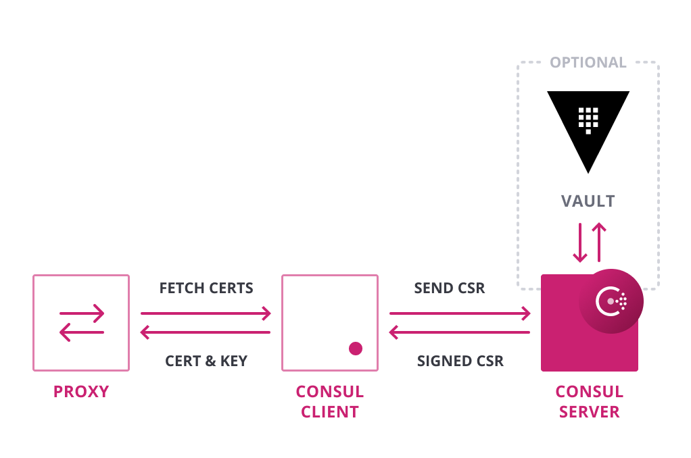
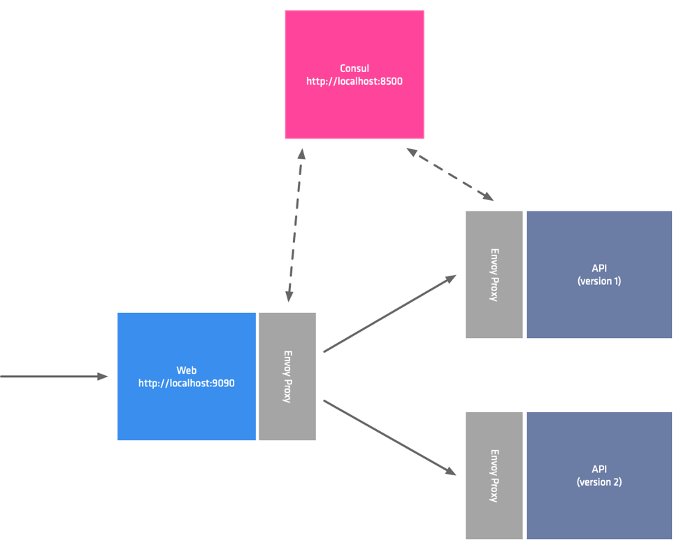
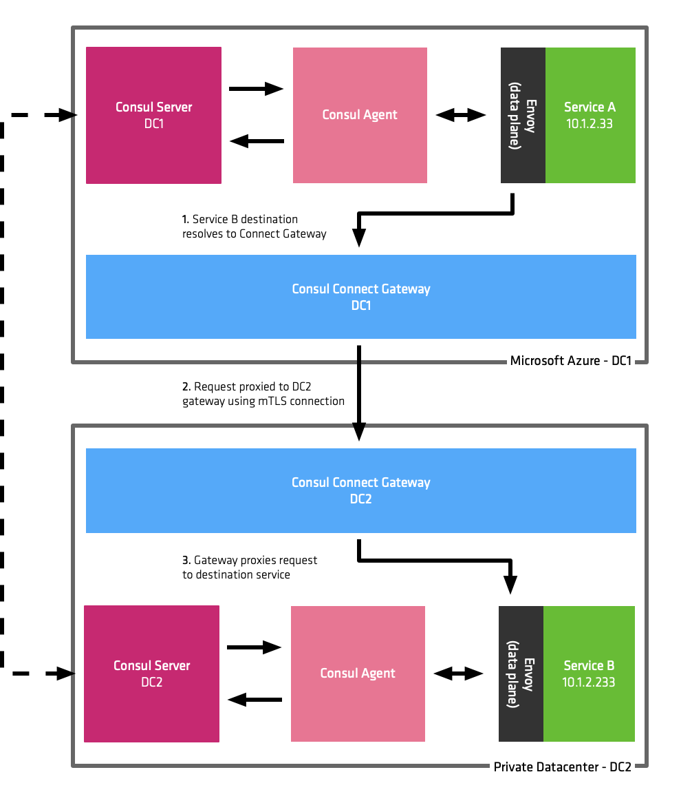

name: Chapter-6
class: title
# Chapter 6
## Service Segmentation

---
name: Segmentation-Intro-Routing
class: img-right compact
Service Segmentation - Intro
-------------------------
.center[]

* Service naming
* Segmentation
* Authorization
* Routing

???
In a sophisticated environment, Consul provides a distributed service mesh to connect, secure, and configure services across any runtime platform and cloud.

It provides an API driven control plane, which integrates with proxies for the data plane.

This allows critical functionality like naming, segmentation and authorization, and routing to be handled by proxies at the edge rather than using centralized middleware.

---
name: Segmentation-Intro-Security
class: img-right compact
Service Segmentation - Intro
-------------------------
.center[]

* Automatic mTLS
* PKI certificate management
* API-driven

???
In addtition, Consul enables fine grained service segmentation to secure service-to-service communication with automatic TLS encryption and identity-based authorization.

You can also integrate it with common centralized PKI and certificate management.

Service configuration is achieved through API-driven Key/Value store that can be used to easily configure services at runtime in any environment.

---
name: Segmentation-Control-Plane
class: img-right compact
Service Mesh Architecture - Control Plane
-------------------------
.center[]

* Single source of truth
* Manage node services
* Manage access

???
The Control Plane is responsible for making decisions about where to send the traffic and to configure the data plane. It's also responsible for features like network policy enforcement and providing service discovery data to the data plane.

Consul is the control plane for the Connect service mesh:

* Single source of truth for service catalog, routing, and access policies
* Manages registered services and health checks for that node
* Manages certificates and access policies and configures the proxy

---
name: Segmentation-Data-Plane
class: img-right compact
Service Mesh Architecture - Data Plane
-------------------------
.center[]

* Manage application requests
* High throughput, low latency
* Advanced Layer 7 features

???
The Data Plane provides the ability to forward requests from the applications, including more sophisticated features like health checking, load balancing, circuit breaking, authentication, and authorization.

The Data Plane is in the critical path of data flow from one application to the other and hence the need for high throughput and low latency.

The Consul Envoy integration is currently the primary way to utilize advanced layer 7 features provided by Consul, but can integrate with other third party proxies.

---
name: Segmentation-Identity
class: img-right compact
Service Mesh - Identity
-------------------------
.center[]

Consul provides each service with an identity encoded as a TLS certificate.

* Provide service identity
* Encryption of all traffic
* Standard TLS certificate with SPIFFE compatibility
* Built-in certificate authority (CA) or integrated with 3rd party CA, such as Vault

---
name: Segmentation-Access-Graph
class: img-right compact
Service Mesh - Service Access Graph
-------------------------
.center[]

Allows or denies service-to-service communication with Intentions

* Logical service name (not IP)
* Scales independent of instances
* Consistency insured with Raft
* Manage with web UI, CLI, and API
* Multi-datacenter support

---
name: Segmentation-Access-Graph
class: img-right compact
Service Mesh - Advanced Routing
-------------------------
.center[]

Layer 7 traffic management allows operators to divide L7 traffic between different subsets of service instances when using Connect.

There are many ways you may wish to carve up a single datacenter's pool of services beyond simply returning all healthy instances for load balancing:

* Canary testing
* A/B tests
* Blue/Green deploys
---
name: Segmentation-Mesh-Gateways
class: img-right compact
Service Mesh - Mesh Gateways
-------------------------
.center[]

Mesh gateways enable routing of Connect traffic between different Consul datacenters:

* Datacenters can reside in different clouds or runtime environments where general interconnectivity between all services in all datacenters isn't feasible.
* Gateways operate by sniffing the SNI header out of the Connect session and then route the connection to the appropriate destination based on the server name requested.
* The data within the Connect session is not decrypted by the Gateway.

---
name: Segmentation-Lab
# 👩‍💻 Lab Exercise: Service Segmentation
.blocklist[
You will accomplish the following in this lab:

* Deploy a Sidecar
* Learn about the Envoy Proxy
* Deploy and configure a Proxy
* Use Consul to connect and secure traffic
]

Your instructor will provide the URL for the lab environment.
---
name: Segmentation-Lab-K8s
# 👩‍💻 Bonus Lab: Service Segmentation - K8s
.blocklist[
You will accomplish the following in this lab:

* Deploy Connect on K8s
* Connect a microservice
* Scale your application
* Observe application performance
]

Your instructor will provide the URL for the lab environment.

---
name: Segmentation-Lab-Hybrid
# 👩‍💻 Bonus Lab: Service Segmentation - Hybrid
.blocklist[
You will accomplish the following in this lab:

* Deploy Connect on K8s and VMs
* Connect two datacenters over a WAN
* Use Mesh Gateways to solve for multi-datacenter network complexities
]

Your instructor will provide the URL for the lab environment.
